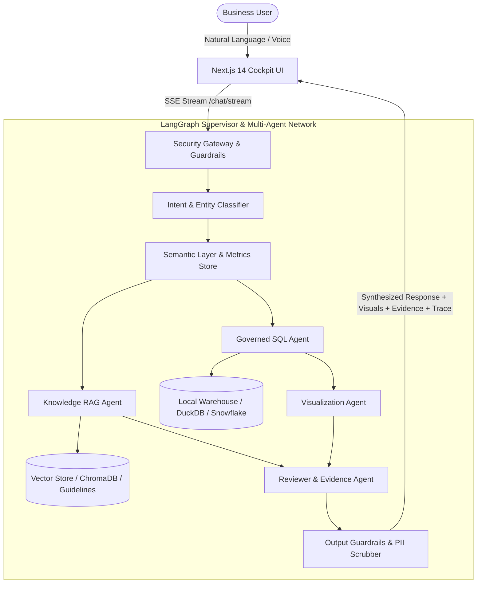

# Opella AI Decision Cockpit — Architecture & Technical Specifications

## 1. System Overview

The **Opella AI Decision Cockpit** is an enterprise-grade conversational analytics and decision-support platform designed for commercial, finance, supply-chain, and operational decision-makers. It unifies structured analytics (data warehouse queries via Text-to-SQL), unstructured enterprise knowledge (Retrieval-Augmented Generation / RAG), business guideline compliance, and tool execution (Model Context Protocol / MCP) within a secure, governed multi-agent architecture.



---

## 2. Core Architectural Pillars

### 2.1 Multi-Agent Orchestration (LangGraph Supervisor)
- **StateGraph** coordinates asynchronous agent nodes:
  1. `security`: Prompt injection filtering, input scrubbing, PII redacting.
  2. `intent`: Identifies domain (Commercial, Finance, Supply Chain), entity extraction, intent classification.
  3. `semantic`: Resolves business terms against the governed Semantic Layer (e.g., standard definitions for Gross Margin, Doliprane SKU hierarchies).
  4. `analytics`: Generates, validates, and executes syntactically and semantically correct SQL queries against the analytical warehouse.
  5. `rag`: Fetches context from company policies, distribution contracts, and supply chain SOPs.
  6. `visualization`: Emits declarative chart specifications (Recharts-compatible JSON), strictly preventing un-sanitized client-side JS execution.
  7. `reviewer`: Validates numerical claims against executed SQL results, identifies hallucination risks, and computes confidence scores.
  8. `summary`: Streams synthesized executive insights, KPIs, tables, and citations.

### 2.2 Governed Semantic Layer
- Centralizes business metric definitions, dimension hierarchies, and table schemas.
- Maps business inquiries to authoritative schema elements, avoiding arbitrary database queries.

### 2.3 Dual Warehouse Architecture (Production vs Local Demo Adapter)
- **Production Adapter**: Connects securely to Snowflake / Databricks with credential isolation and row-level access control.
- **Local Demo Adapter**: In-memory DuckDB initialized with synthetic commercial, financial, and supply chain datasets (Doliprane, Essentiale, Buscopan, Allegra) with explicit metadata tracking for demo reliability.

### 2.4 Streaming Observability & Trace Pipeline
- Full server-sent event (SSE) stream emits step-by-step agent execution nodes with duration metrics and node status (`running` → `success` / `failed`), visualized directly in the Cockpit Execution Trace panel.

---

## 3. Directory Layout

```
opella/
├── apps/
│   ├── frontend/         # Next.js 14 App Router, Tailwind CSS, Recharts, Lucide
│   └── backend/          # FastAPI, LangGraph, DuckDB/Snowflake, Structlog
├── prompts/              # Versioned YAML prompt templates
│   ├── intent/v1.yaml
│   ├── sql/v1.yaml
│   └── visualization/v1.yaml
├── dbt/                  # Staging, intermediate, and marts transformation models
├── rag/                  # Enterprise documents and ingestion scripts
├── mcp/                  # Model Context Protocol adapters (Snowflake, dbt, ServiceNow)
├── evaluation/           # Golden test datasets and automated benchmark runners
├── docs/                 # Architecture, user guide, and API specifications
├── docker-compose.yml    # Containerized multi-service deployment
└── Makefile              # One-command developer workflows
```
